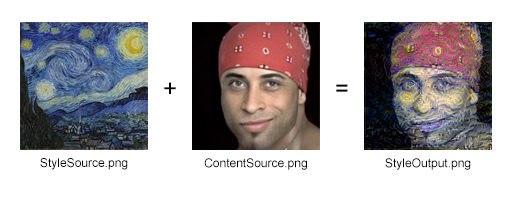

# StyleChanger
Image-to-image style transferring solution written with C++ and CUDA based on [this](https://arxiv.org/abs/1508.06576) article and [VGG19](https://keras.io/api/applications/vgg/).

## How to use
Create two 128x128 images:
* "StyleSource.png" - source image of the style.
* "ContentSource.png" - destination image for the style.  
  
Put these two pictures in the program folder and run the program.  
Enter the required variables:
* "Change rate" - rate, at which the original image is changed.
* "Content coefficient" - weight of the "content" component from "ContentSource.png" image.
* "Style coefficient" - weight of the "style" component from "StyleSource.png" image.  

You'll be able to see the output in the "StyleOutput.png" image file.

## Example
```
Change rate: 1.0
Content coefficient: 0.01
Style coefficient: 1.0
2500 iterations
```


## Acknowledgements
* [A Neural Algorithm of Artistic Style](https://arxiv.org/abs/1508.06576), by Leon A. Gatys, Alexander S. Ecker and Matthias Bethge.
* [CImg](https://cimg.eu/), used for processing images.
* [ImageMagick](https://imagemagick.org/), required for CImg to work properly.
